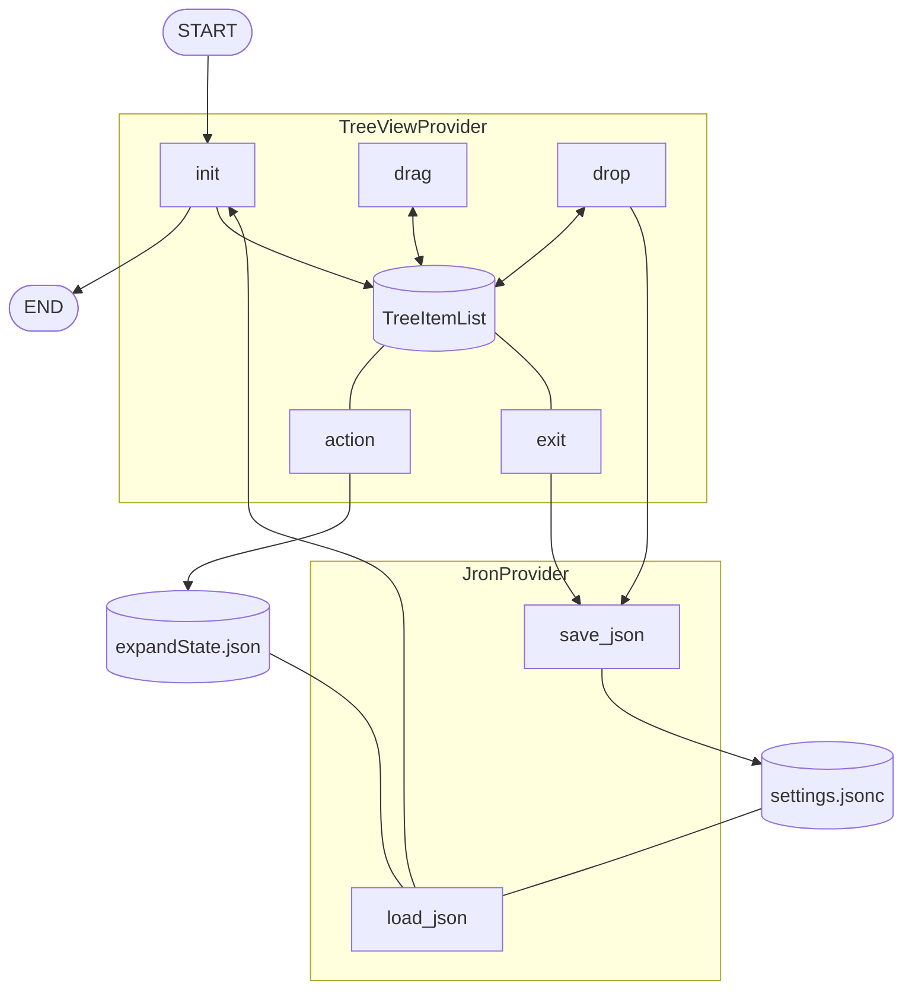

```mermaid
flowchart TB

    START([START])-->
    init-->
    END([END])

    subgraph id_925859[TreeViewProvider]
        id_045202[(TreeItemList)]
        init
        drag
        drop
        action
        exit
    end
    
    subgraph id_074972[JronProvider]
        load_json
        save_json    
    end

    id_902823[(settings.jsonc)]
    id_164236[(expandState.json)]
    
    
    
    id_902823 & id_164236---load_json
    save_json-->id_902823
    
    load_json-->init-->id_045202
    id_045202---action-->id_164236
    drag & drop <-->id_045202
    id_045202---exit-->save_json
    drop-->save_json
    

```